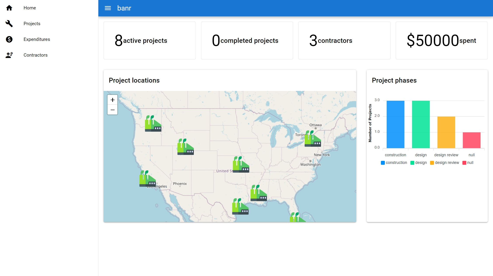
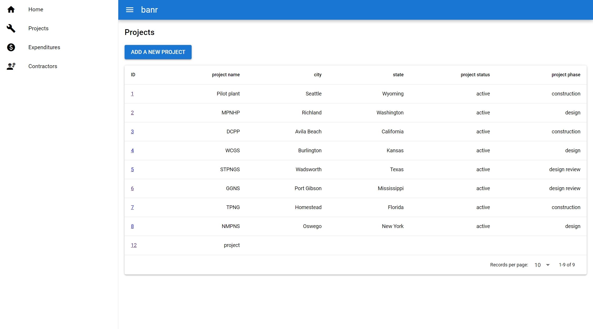

# banr (build a nuclear reactor)

banr is a mock nuclear reactor construction project management application built wit `django`, `django rest framework`, `quasar`, and `vue`. 

I created this project 
- to learn `vue` and `quasar`
- bursh up on `django` which I have not used in a while
- to learn about nuclear reactors and what goes into building them. 

The backend contains 3 models `NuclearReactorConstructionProject`, `Expenditure`, `Contractor`. They correspond to 3 api endpoints `/projects`, `/expenditures`, and `/contractors`. I've implemented CRUD operations for the projects model using the UI (see screenshots below).  

### Try it yourself
The easiet way to launch the app is using docker compose. 

First clone the project 
```
git cone https://github.com/beemnet20/banr.git
```

Then cd into the project 

```
cd banr
```

Then run the following commands

```
docker-compose build
docker-compose up
```

This should launch a client app at [localhost:9000](http://localhost:9000)

### Note
The data that comes with this repo is fictitious and used only for dev/practice purposes. 

### Screenshots





